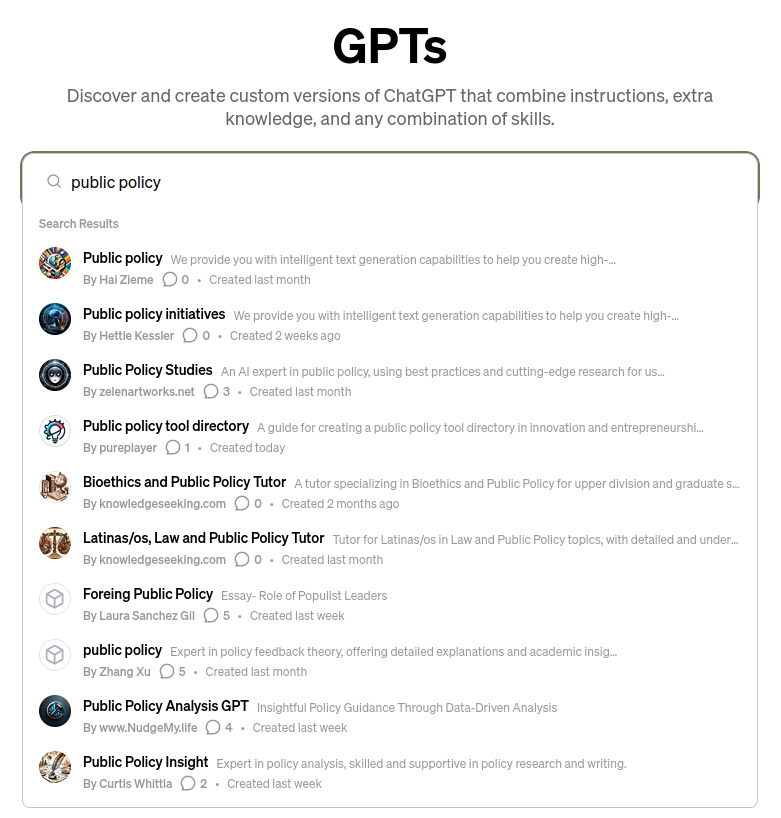

# How does ChatGPT work?

There are tons of other articles and videos online that explain how ChatGPT works, and we won't try to duplicate them here. Instead, this page just covers some aspects that are particularly important for policy applications.

 

## No planning: One word at a time

Surprisingly, AI language models like GPT have no ability to "plan" their responses. They actually produce text via a shockingly simple process: producing one single word at a time, by guessing the most likely word based on the prior words in a sequence of text. (Compare this to the familiar auto-suggest feature your smartphone keyboard, which suggests likely next-words as you type.) When ChatGPT is responding to you it has no idea what it is going to say later in the message; it is are simply just trying to guess the next word based on the previous words in the sentence, based on patterns observed in its training data. 

 

## Huge models trained on huge data

How does ChatGPT have such impressive conversational capabilities if it can only guess one word at a time? The answer lies in their sheer size: they are able to learn impressively complex patterns because they represent the associations with enormous models having billions (or even trillions) of crudely-simulated neurons, connected to each other in many layers. The recent LLM boom was caused by a key innovation that allows more-efficient representation of large texts in the models~\cite{vaswaniAttentionAllYou2017a}, allowing them to make associations not only between nearby words in a sentence, but also associating patterns between words and clauses in other paragraphs, and further up and down different parts of the text. These efficiency improvements enabled well-resourced technology companies to train models on massive bodies of text comprising of trillions of words (indeed almost all of the public text on the Internet, among other sources, teaching the models patterns and associations between many different concepts and incorporating an enormous amount of information; these associations give the model a contextual *"understanding of the world."*

Language models with conversational capabilities, like ChatGPT, are able to follow a user's instructions because the models' training data included many examples of conversations and instruction-following, and gave them special emphasis. For these reasons, applications like ChatGPT are able to have a natural-feeling conversation with a user, even though they are essentially still just trying to guess the next word by imitating patterns in their training data.

 

#### Additional Resources
**TO DO** add some helpful links

  

## Secrecy: a "black box"

GPT and most of the other popular AI Language Models are *black boxes:* the details of their model structure and training data are kept secret. This makes them difficult to scrutinize, since we can only study them by examining their behavior. This secrecy compounds the models' already poor *explainability* due to their massive complexities: when an AI chatbot generates an answer, it is very difficult to trace back its steps and understand why it answered the way that it did. Our poor understanding of their inner workings makes it difficult to trust AI language models for high-stakes applications like policy.

 

## Errors and hallucinations
GPT and similar AI models sometimes produce errors in their answers, and these errors are often hard to predict and difficult to detect. One type of error is popularly known as *"hallucinations."* Hallucinations stem from the models' mechanism of generating text by guessing one word at a time: they can sometimes generate nonsensical answers that sound plausible but are not rooted in reality. One of the most famous examples of hallucinations is ChatGPT's tendency to make up fake citations when asked to cite its sources; often making up plausible-sounding article titles and author lists, as well as a fake DOI code for an article that doesn't exist. These errors and hallucinations can be difficult to detect when the AI bots present wrong information in a confident tone, making them sound very plausible.

 
    

        

        

            <h5 class="card-title">Example Hallucination</h5> 
            
            
<b>Question:</b> Are marine genetic resources the common
heritage of mankind?

            
<b>BBNJ Chatbot Answer:</b> Yes, marine genetic resources of ar-
eas beyond national jurisdiction are considered the
common heritage of mankind and no state shall
claim or exercise sovereignty or sovereign rights
over them. This is stated in multiple paragraphs,
including in Article 4 of the Draft Agreement, which
states that no state shall claim or exercise sovereignty
or sovereign rights over marine genetic resources
of areas beyond national jurisdiction. Additionally,
Article 5 of the same document states that activities
with respect to marine genetic resources of areas
beyond national jurisdiction are in the interests of all
states and for the benefit of all humanity.

        

        
<small><b>Commentary:</b> This answer is incorrect. The
BBNJ agreement does not explicitly state that
marine genetic resources of areas beyond national
jurisdiction are the common heritage of mankind;
the agreement did not go that far. Additionally,
Article 4 does not relate to this question.
The bot may have given this wrong answer
because it is missing context, and does not “know”
that the “common heritage of mankind” refers
to a specific legal principle. Rather, it answers
affirmatively because it finds similar words and
phrases like “benefit of all humanity.”</small>

    

    

        

            <h5 class="card-title">Example Hallucination</h5> 
            
            
<b>Question:</b> Does the BBNJ final draft agreement
apply to warships?

            
<b>BBNJ Chatbot Answer:</b> Yes, the final draft agreement of the
BBNJ does not apply to warships, military aircraft,
or naval auxiliary. This exception is stated in various
documents, including...

        

        
<small><b>Commentary:</b> This example hallucination shows how GPT can "hallucinate" by just generating words one at a time, without planning what it will say later in the sentence. This answer is mostly correct, but
confusing: the chatbot initially begins by answering
affirmatively "yes," but continues on (correctly) to
say that the agreement does not apply. The confusing
wording here could easily be misunderstood.</small>

    

    

   

## Connecting to external information

General-purpose AI models like ChatGPT can converse about a variety of topics with moderate accuracy, companies and researchers are increasingly building specific-purpose LLM tools that are becoming more accurate and capable of being applied to a specific topic, by connecting them to databases of documents and information. This approach has been shown to reduce hallucinations somewhat. There are already a variety of free and commercial products on the market following this design pattern in response to industry demand in different sectors, from analyzing medical records to chatting about a company's internal knowledge base. We are already starting to see AI products for law and policy, that work by connecting an AI model to a database of law and policy information. (To see some examples, you can search for law or policy in the <a href="https://chat.openai.com/gpts" target="_blank">GPT store</a>.)

 
    

        
        

            <h5 class="card-title">Specialized Chatbots</h5>
            
This screenshot shows the variety of policy-focused custom chatbots from a search on the <a href="https://chat.openai.com/gpts" target="_blank">GPT store</a>. These are made by connecting ChatGPT to external sources of information, and sometimes giving it special instructions.

        

    

 

